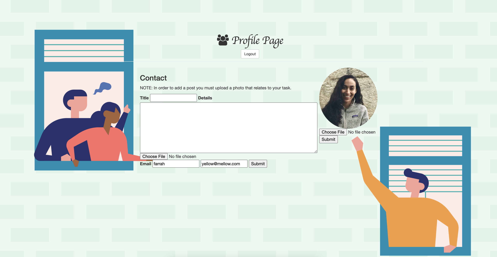
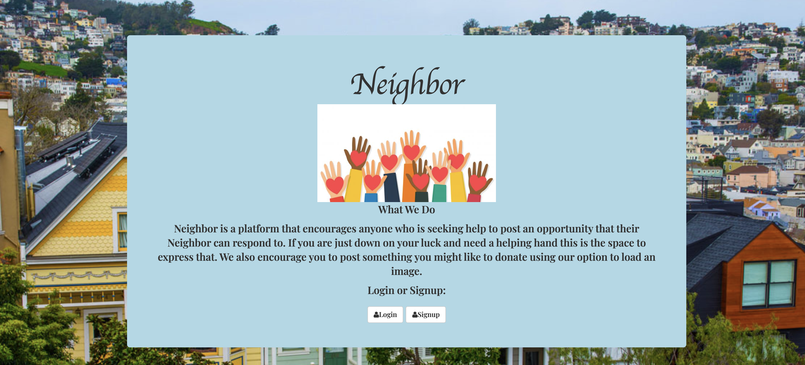
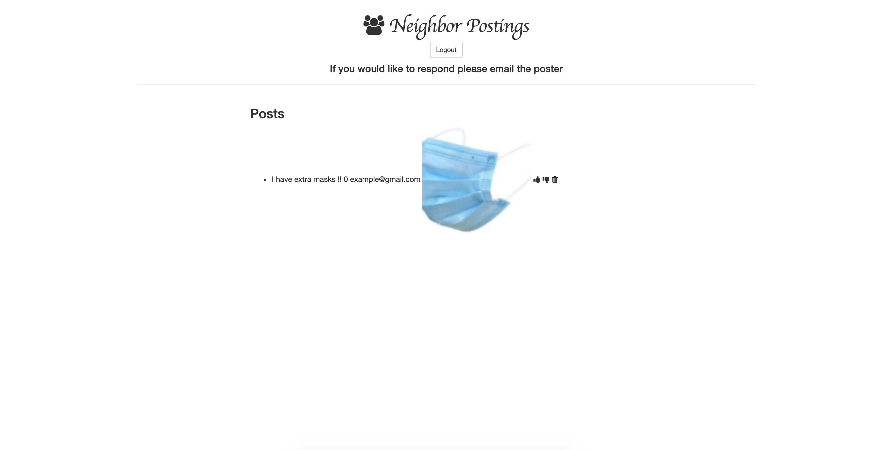

# Demo-Project
 
 
 
  
# Made with:
####  HTML5, CSS3, JavaScript, Node.js, Express, EJS, Mongodb.
# Project Goal:
#### This is a starter API of my Demo Project users can load a profile image as well as the image of the task they are seeking help with.I would like to add a feature that allows just the creator of the post. Future add ons will be a Navigation bar and the ability to comment on a post. I would like this to be a resource for individuals who are seeking aid and a place where an individual would like to lend a hand. Transitioning it to Social platform to gather for neighbors.
